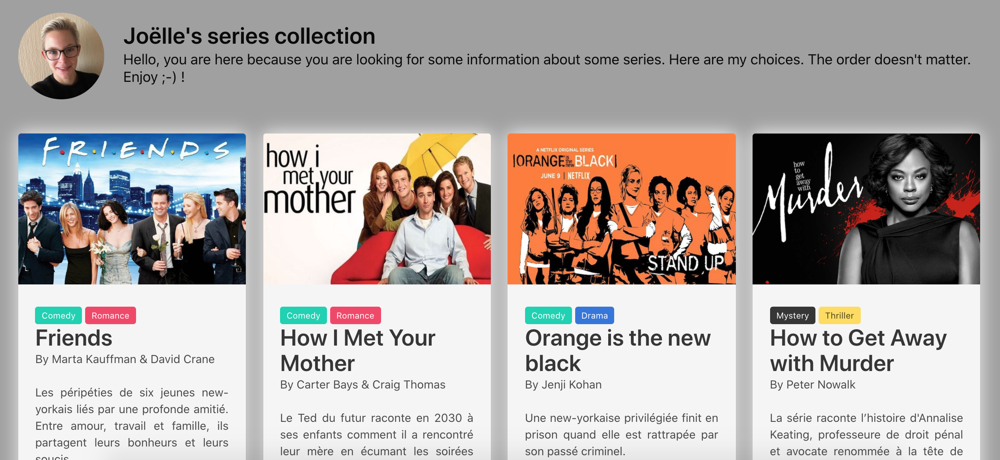

# Projet Collection

* Solo project made by me: [Joelle Everaert](https://github.com/Joelle-Everaert) :blush:

* date

## What is this ?
It's a web page with my 10 favorite series.  
My series are listed by genre and with a youtube link to the trailer.

## Context  

During my Web Dev training at **[BeCode](https://becode.org)**

## Purpose?
Put into practice our knowledge learned during the training course.

## Languages used?
* HTML5
* CSS3
* Framework => BULMA

## Overview :collision:
*Click on the picture* :wink:

### Original instruction

> [Link](https://github.com/becodeorg/bxl-hopper-1-25/tree/master/The%20Field/5.leaving_the_field)

